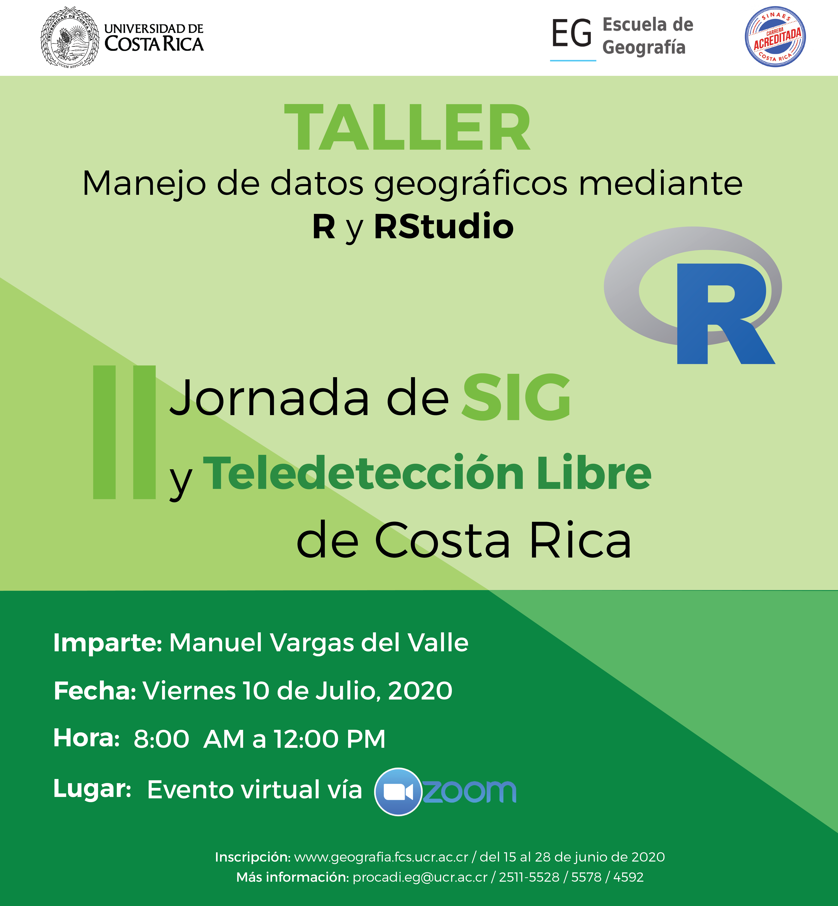

```{r setup, include=FALSE}
knitr::opts_chunk$set(echo = TRUE)
```



## Presentación
Este sitio web aloja los contenidos del taller "Manejo de datos geográficos mediante R y RStudio", el cual es parte de la [II Jornada de Sistemas de Información Geográfica (SIG) y Teledetección (TD) libre de Costa Rica](https://www.geografia.fcs.ucr.ac.cr/index.php/laboratorios/313-ii-jornadas-de-sig-2020), organizada por la [Escuela de Geografía de la Universidad de Costa Rica](https://www.geografia.fcs.ucr.ac.cr/).

El sitio contiene tanto las explicaciones teóricas como el código fuente en R que las ejemplifica y los enlaces a los datos utilizados.

## Introducción
Durante las últimas décadas, las aplicaciones SIG de escritorio (ej. ArcGIS, QGIS) han sido la forma más popular de procesamiento de datos geográficos mediante computadoras. Estas aplicaciones están basadas en una interfaz gráfica a la que el usuario accede mediante menús, botones, íconos y otros elementos similares. A pesar de sus ventajas, entre las que pueden destacarse su facilidad de uso y rápida curva de aprendizaje, los procesos realizados con la interfaz gráfica de un SIG de escritorio son difícilmente reproducibles o repetibles.

Los enfoques basados en interfaces de líneas de comandos ofrecen ventajas mucho mayores en cuanto a reproductibilidad que los basados en interfaces gráficas. Una investigación reproducible es aquella que puede ser realizada de nuevo por personas diferentes a su autor, de manera tal que puedan obtener los resultados originales al seguir la misma metodología. Por lo general, la reproductibilidad requiere que tanto los comandos como los datos utilizados estén disponibles para quienes deseen utilizarlos.

Los comandos se agrupan en programas, también llamados _scripts_ en inglés. Por ejemplo, la siguiente secuencia de comandos en el lenguaje de programación R carga la capa de cantones de Costa Rica, filtra aquellos con área mayor o igual a 2000 km2, lista los nombres y presenta los polígonos en un mapa:

```{r message=FALSE, warning=FALSE}
# Paquete para manejo de datos vectoriales
library(sf)

# Lectura de la capa de cantones
cantones <-
  st_read(
          "https://raw.githubusercontent.com/taller-r-jornadas-sigtd-2020/datos/master/cantones.geojson", 
          quiet = T
)

# Filtro de los cantones "grandes" (area >= 2000)
cantones_grandes <- cantones[cantones$area >= 2000, ]

# Despliegue de los nombres y de las áreas de los cantones grandes
cantones_grandes[, c("canton", "area"), drop = TRUE]


# Mapeo de los cantones grandes
plot(cantones_grandes["area"], axes = TRUE, graticule = TRUE)
```

Varios lenguajes de programación, además de R, permiten manejar datos geoespaciales de manera similar.


## El lenguaje de programación R
[R](https://www.r-project.org/) es un lenguaje de programación enfocado en análisis estadístico. Es ampliamente utilizado en diversas áreas de investigación, entre las que pueden mencionarse [aprendizaje automático (_machine learning_)](https://en.wikipedia.org/wiki/Machine_learning), [ciencia de datos](https://en.wikipedia.org/wiki/Data_science) y [_big data_](https://en.wikipedia.org/wiki/Big_data), con aplicaciones en campos como biomedicina, bioinformática y finanzas, entre muchos otros. Fue creado por Ross Ihaka y Robert Gentleman en la Universidad de Auckland, Nueva Zelanda, en 1993.

Algunas de las principales características de este lenguaje son:

* Es [interpretado](https://en.wikipedia.org/wiki/Interpreter_(computing)): las instrucciones se traducen una por una a [lenguaje máquina](https://en.wikipedia.org/wiki/Machine_code), a diferencia de los [lenguajes compilados](https://en.wikipedia.org/wiki/Compiler), que traducen de manera conjunta las instrucciones de una unidad completa (ej. un programa o una biblioteca). Los lenguajes interpretados tienden a ser más lentos que los compilados, pero también son más flexibles.
* Es [multiplataforma](https://en.wikipedia.org/wiki/Cross-platform_software): puede ejecutarse en los sistemas operativos más populares (ej. Microsoft Windows, macOS, Linux).
* Tiene un [sistema de tipos de datos dinámico](https://pythonconquerstheuniverse.wordpress.com/2009/10/03/static-vs-dynamic-typing-of-programming-languages/): las variables pueden tomar diferentes tipos de datos (ej. textuales, numéricos) durante la ejecución del programa, a diferencia del caso de un sistema de tipos de datos estático, en el que las variables solo pueden tener un tipo de datos.
* Soporta varios [paradigmas de programación](https://en.wikipedia.org/wiki/Programming_paradigm): los paradigmas son estilos o enfoques teóricos de programación. R soporta los paradigmas de [programación orientada a objetos](https://en.wikipedia.org/wiki/Object-oriented_programming), [programación imperativa](https://en.wikipedia.org/wiki/Imperative_programming), [programación funcional](https://en.wikipedia.org/wiki/Functional_programming) y [programación procedimental](https://en.wikipedia.org/wiki/Procedural_programming).

R es un proyecto de [software libre](https://en.wikipedia.org/wiki/Free_software) que se comparte mediante una licencia [GNU General Public Licence (GNU GPL)](https://www.gnu.org/licenses/old-licenses/gpl-2.0.html). Esta característica permite que la funcionalidad original de R pueda ser ampliada mediante bibliotecas o paquetes desarrollados por la comunidad de programadores.

Para programar en R, puede utilizarse una interfaz de línea de comandos y también ambientes de desarrollo integrados (IDE, _integrated development environment_) como [Jupyter](https://jupyter.org/) o [RStudio](https://rstudio.com/).

### Instalación de R y RStudio
### Sintaxis
#### Funciones
#### Tipos de datos
### RMarkdown

## El ecosistema geoespacial de R

### Datos vectoriales
### Datos raster

## Recursos recomendados
### R y RStudio
* Sitio web del lenguaje de programación R: [The R Project for Statistical Computing](https://www.r-project.org/)
* Sitio web del entorno de desarrollo RStudio: [RStudio | Open source & professional software for data science teams](https://rstudio.com/)

### Paquetes de R
* Sitio web del paquete sf de R: [Simple Features for R - sf](https://r-spatial.github.io/sf/)
* Sitio web del paquete raster de R: [Raster data manipulation - R](https://rspatial.org/raster/spatial/8-rastermanip.html)
* Sitio web del paquete flexdashboard de R: [flexdashboard: Easy interactive dashboards for R](https://rmarkdown.rstudio.com/flexdashboard/)
* Sitio web del paquete Leaflet para R: [Leaflet for R](https://rstudio.github.io/leaflet/)
* Sitio web del paquete Plotly para R: [Plotly R Open Source Graphing Library](https://plotly.com/r/)
* Sitio web del paquete DT para R: [DT: An R interface to the DataTables library](https://rstudio.github.io/DT/)

### Git
* Sitio web del sistema Git para control de versiones: [Git](https://git-scm.com/)

### Libros
* Libro "Geocomputation with R", de Lovelace et al.: [Geocomputation with R](https://geocompr.robinlovelace.net/)
* Libro "R Markdown: The Definitive Guide", de Xie et al.: [R Markdown: The Definitive Guide](https://bookdown.org/yihui/rmarkdown/)