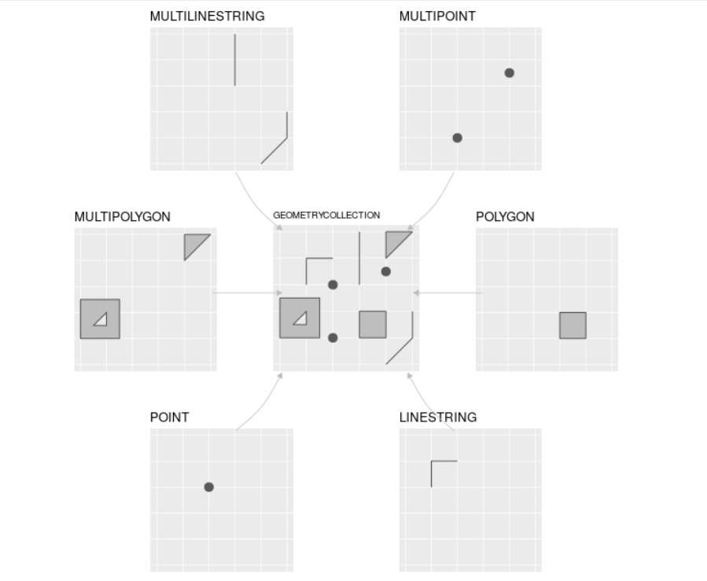
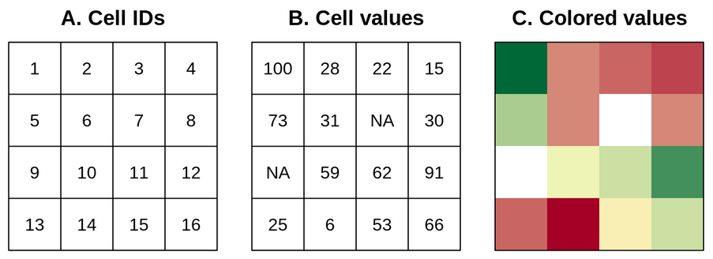
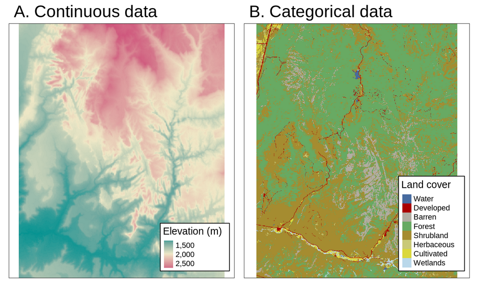

```{r setup, include=FALSE}
knitr::opts_chunk$set(echo = TRUE)
```


## Presentación
Este sitio web contiene los materiales del taller "Manejo de datos geográficos mediante R y RStudio", el cual es parte de la [II Jornada de Sistemas de Información Geográfica (SIG) y Teledetección (TD) libre de Costa Rica](https://www.geografia.fcs.ucr.ac.cr/index.php/laboratorios/313-ii-jornadas-de-sig-2020), organizada por la [Escuela de Geografía de la Universidad de Costa Rica](https://www.geografia.fcs.ucr.ac.cr/).

El sitio contiene tanto las explicaciones teóricas como el código fuente en R que las ejemplifica y los enlaces a los datos utilizados. Todo los recursos están disponibles en [https://github.com/taller-r-jornadas-sigtd-2020](https://github.com/taller-r-jornadas-sigtd-2020).

## ¡Antes de empezar!
Para reproducir los ejemplos en lenguaje R de este taller, primero debe descargar y ejecutar los instaladores de R y RStudio, disponibles en los siguientes enlaces:

* [Instalador de R](https://cloud.r-project.org/). **Nota importante**: a la fecha de escritura de este documento ya está disponible la versión 4 de R. Sin embargo, los ejemplos de este taller se probaron con la [versión 3.6.3 para Windows](https://cran.r-project.org/bin/windows/base/old/3.6.3/R-3.6.3-win.exe).
* [Instalador de RStudio](https://rstudio.com/products/rstudio/download/#download).

**Debe instalarse primero R y luego RStudio**. Si lo desea, puede seguir la guía disponible en [RStudio para Estadística Descriptiva en Ciencias Sociales](https://bookdown.org/gboccardo/manual-ED-UCH/instalacion-de-los-softwares-a-utilizar-en-este-manual.html). También puede consultar [(Tutorial) How to Install R on Windows, Mac OS X, and Ubuntu - DataCamp](https://www.datacamp.com/community/tutorials/installing-R-windows-mac-ubuntu/).

## Introducción
Durante las últimas décadas, las aplicaciones SIG de escritorio (ej. ArcGIS, QGIS) han sido la forma más popular de procesamiento de datos geográficos mediante computadoras. Estas aplicaciones están basadas en una interfaz gráfica a la que el usuario accede mediante menús, botones, íconos y otros elementos similares. A pesar de sus ventajas, entre las que pueden destacarse su facilidad de uso y rápida curva de aprendizaje, los procesos realizados con la interfaz gráfica de un SIG de escritorio son difícilmente reproducibles o repetibles.

Los enfoques basados en interfaces de líneas de comandos ofrecen ventajas mucho mayores en cuanto a reproductibilidad que los basados en interfaces gráficas. Una investigación reproducible es aquella que puede ser realizada de nuevo por personas diferentes a su autor, de manera tal que puedan obtener los resultados originales al seguir la misma metodología. Por lo general, la reproductibilidad requiere que tanto los comandos como los datos utilizados estén disponibles para quienes deseen utilizarlos.

Los comandos se agrupan en programas, también llamados _scripts_ en inglés. Por ejemplo, la siguiente secuencia de comandos del lenguaje de programación R carga desde un archivo GeoJSON la capa de cantones de Costa Rica y filtra aquellos con área mayor o igual a 2000 km2:

```{r eval=FALSE}
# Instalación del paquete sf para manejo de datos vectoriales
install.packages("sf")
```

```{r message=FALSE, warning=FALSE}
# Carga del paquete sf
library(sf)

# Lectura de la capa de cantones de un archivo GeoJSON
sf_cantones <-
  st_read(
          "https://raw.githubusercontent.com/taller-r-jornadas-sigtd-2020/datos/master/cantones.geojson", 
          quiet = T
)

# Filtro de los cantones "grandes" (area >= 2000)
sf_cantones_grandes <- sf_cantones[sf_cantones$area >= 2000, ]
```

Note el uso del símbolo ```#``` para realizar "comentarios" en el [código fuente](https://es.wikipedia.org/wiki/C%C3%B3digo_fuente) del programa.

El siguiente comando lista los cantones seleccionados:
```{r message=FALSE, warning=FALSE, collapse=TRUE}
# Despliegue de los nombres y de las áreas de los cantones grandes
sf_cantones_grandes[, c("canton", "area"), drop = TRUE]
```

La función ```plot()``` despliega un mapa de los cantones seleccionados:
```{r message=FALSE, warning=FALSE}
# Mapeo de los cantones grandes
plot(sf_cantones_grandes["area"], axes = TRUE, graticule = TRUE)
```

Otros lenguajes de programación permiten manejar datos geoespaciales de manera similar a R. Entre estos, destaca [Python](https://www.python.org/), un lenguaje de propósito general con un desarrollo muy activo en el área geoespacial. Otros lenguajes de importancia en esta área son [JavaScript](https://es.wikipedia.org/wiki/JavaScript), para desarrollo en la Web y [SQL](https://es.wikipedia.org/wiki/SQL), para bases de datos.

## El lenguaje de programación R
[R](https://www.r-project.org/) es un lenguaje de programación enfocado en análisis estadístico. Es ampliamente utilizado en diversas áreas de investigación, entre las que pueden mencionarse [aprendizaje automático (_machine learning_)](https://en.wikipedia.org/wiki/Machine_learning), [ciencia de datos](https://en.wikipedia.org/wiki/Data_science) y [_big data_](https://en.wikipedia.org/wiki/Big_data), con aplicaciones en campos como biomedicina, bioinformática y finanzas, entre muchos otros. Fue creado por Ross Ihaka y Robert Gentleman en la Universidad de Auckland, Nueva Zelanda, en 1993.

Algunas de las principales características de este lenguaje son:

* Es [interpretado](https://en.wikipedia.org/wiki/Interpreter_(computing)): las instrucciones se traducen una por una a [lenguaje máquina](https://en.wikipedia.org/wiki/Machine_code), a diferencia de los [lenguajes compilados](https://en.wikipedia.org/wiki/Compiler), que traducen de manera conjunta las instrucciones de una unidad completa (ej. un programa o una biblioteca). Los lenguajes interpretados tienden a ser más lentos que los compilados, pero también son más flexibles.
* Es [multiplataforma](https://en.wikipedia.org/wiki/Cross-platform_software): puede ejecutarse en los sistemas operativos más populares (ej. Microsoft Windows, macOS, Linux).
* Tiene un [sistema de tipos de datos dinámico](https://pythonconquerstheuniverse.wordpress.com/2009/10/03/static-vs-dynamic-typing-of-programming-languages/): las variables pueden tomar diferentes tipos de datos (ej. textuales, numéricos) durante la ejecución del programa, a diferencia del caso de un sistema de tipos de datos estático, en el que las variables solo pueden tener un tipo de datos.
* Soporta varios [paradigmas de programación](https://en.wikipedia.org/wiki/Programming_paradigm): los paradigmas son estilos o enfoques teóricos de programación. R soporta los paradigmas de [programación orientada a objetos](https://en.wikipedia.org/wiki/Object-oriented_programming), [programación imperativa](https://en.wikipedia.org/wiki/Imperative_programming), [programación funcional](https://en.wikipedia.org/wiki/Functional_programming) y [programación procedimental](https://en.wikipedia.org/wiki/Procedural_programming).

R es un proyecto de [software libre](https://en.wikipedia.org/wiki/Free_software) que se comparte mediante una licencia [GNU General Public Licence (GNU GPL)](https://www.gnu.org/licenses/old-licenses/gpl-2.0.html). Esta característica permite que la funcionalidad original de R pueda ser ampliada mediante bibliotecas o paquetes desarrollados por la comunidad de programadores.

### Sintaxis
#### Funciones y paquetes

##### Funciones
R, al igual que otros lenguajes de programación, estructura su funcionalidad por medio de segmentos de código llamados funciones. Cada función realiza una tarea específica como, por ejemplo, un cálculo matemático. Todas las funciones tienen un nombre y un conjunto de parámetros que especifican los datos de entrada que procesa la función. Los parámetros se escriben entre paréntesis redondos (```()```) y estos siempre deben incluirse, aún en el caso de que la función no tenga ningún parámetro. Si la función tiene varios parámetros, deben separarse mediante comas (```,```).

Por ejemplo, la función ```print()``` recibe como parámetro un valor (ej. un texto o un número) para imprimirlo en la pantalla. En el siguiente fragmento de código en R, se utiliza ```print()``` para imprimir la hilera ["Hola mundo"](https://en.wikipedia.org/wiki/%22Hello,_World!%22_program).

```{r collapse=TRUE}
# Impresión de una hilera de carácteres
print("Hola mundo")
```

La función  ```mean()``` retorna la media aritmética del parámetro de entrada. En el siguiente ejemplo, se calcula la media de los números de un vector creado a su vez con la función ```c()```.

```{r collapse=TRUE}
# Media aritmética
mean(c(2, 4, 5, 9))
```

La función ```getwd()``` (_get working directory_) retorna la ruta del directorio de trabajo de la sesión actual de R. Este es el directorio en el cual R espera encontrar, por ejemplo, archivos de datos.

```{r collapse=TRUE}
# Consultar directorio de trabajo
getwd()
```

La función ```setwd()``` (_set working directory_) establece la ruta del directorio de trabajo de la sesión actual de R. Como parámetro, recibe una hilera de texto con la ruta.

```{r eval=FALSE}
# Establecer directorio de trabajo (la ruta debe existir)
setwd("c:/users/mfvargas")
```

Los parámetros de las funciones tienen nombres que pueden especificarse en caso de ser necesario. En el siguiente ejemplo, se utilizan los nombres de los parámetros ```x```, ```xlab``` y ```ylab``` de la función ```plot()``` para especificar la fuente de datos y las etiquetas de los ejes x e y de un gráfico.

```{r}
# Gráfico con etiquetas en los ejes x e y
plot(
  x=cars, 
  xlab="Velocidad", 
  ylab="Distancia"
)
```

**Nota**: para efectos de pruebas y ejemplos, el interpretador de R incorpora varios conjuntos de datos en la forma de data frames que pueden listarse con la función ```data()```. Para consultar un conjunto en particular, puede utilizarse el operador  ```? ``` desde la línea de comandos de R (ej. ```?cars```).

Para obtener ayuda de una función desde la línea de comandos de R, puede utilizarse un signo de pregunta (```?```) seguido del nombre de la función. Por ejemplo:

```{r eval=FALSE}
# Ayuda de la función setwd()
?setwd
```

También puede obtenerse ayuda sobre una función en los buscadores de Internet (ej. Google), además de ejemplos y otros materiales de apoyo.

##### Paquetes
Las funciones de R se agrupan en conjuntos llamados bibliotecas, las cuales se distribuyen en [paquetes](https://cran.r-project.org/web/packages/available_packages_by_name.html). Para utilizar un paquete, este debe instalarse primero con la función ```install.packages()``` y luego cargarse con la función ```library()```. Por ejemplo:

```{r eval=FALSE}
# Instalación del paquete rgdal (note las comillas)
install.packages("rgdal")
```

```{r message=FALSE, warning=FALSE}
# Carga del paquete rgdal
library(rgdal)
```

#### Tipos de datos, objetos y variables

R puede trabajar con varios tipos de datos, entre los que están números, carácteres (i.e. textos) y _booleanos_ (o lógicos). También utiliza tipos más complejos, como vectores y matrices.

Como se mencionó anteriormente, R es un lenguaje de programación orientado a objetos. Un objeto es una entidad que tiene asociadas propiedades y métodos para manipular esas propiedades. Un objeto puede ser, por ejemplo, un número, un texto, un vector o una matriz.

Hay muchas formas de crear objetos en R. Una de las más sencillas es con los operadores de asignación. Estos son ```=``` y ```<-```. Las siguientes sentencias crean un número, un texto y un vector.

```{r collapse=TRUE}
# Número
x <- 10

# Hilera de carácteres
nombre <- 'Manuel'

# Vector de hileras de carácteres
dias <- c('Domingo', 'Lunes', 'Martes', 'Miércoles', 'Jueves', 'Viernes', 'Sábado')
```

Tanto ```x```, como ```nombre``` como ```dias``` son variables. Una variable es una etiqueta que se le asigna a un valor (o a un objeto). Una variable tiene un nombre que debe comenzar con una letra.

El tipo de una variable (u objeto) puede consultarse con la función ```typeof()```. Por ejemplo:

```{r collapse=TRUE}
typeof(x)
typeof(nombre)
```

A continuación, se describen con más detalle algunos de los tipos de datos utilizados en el lenguaje R.

##### Números
Pueden ser enteros o fracciones. Se utilizan en operaciones aritméticas (ej. suma, resta, multiplicación, división).

```{r collapse=TRUE}
# Números enteros
x <- 10
y <- 20

# Suma
x + y
```

```{r collapse=TRUE}
# Números decimales
x <- 0.5
y <- 3.14

# Multiplicación
x * y
```

##### Carácteres
Se utilizan para representar textos. Deben estar encerrados entre comillas simples ```'```o dobles ```"```.

```{r collapse=TRUE}
# Hileras de carácteres
nombre <- "María"
apellido <- "Pérez"

# Concatenación
paste(nombre, apellido)
```

##### Booleanos
Los objetos _booleanos_ (también llamados lógicos) tienen dos posibles valores: verdadero (```TRUE```) o falso (```FALSE```).

```{r collapse=TRUE}
# Variable booleana
b = 1 < 2

b
```

```{r collapse=TRUE}
# Variable booleana
c = 1 > 2

c
```

Las expresiones booleanas pueden combinarse con operadores como: 

* ```&``` (Y, en inglés _AND_)
* ```|``` (O, en inglés _OR_)
* ```!``` (NO, en inglés _NOT_)

```{r collapse=TRUE}
# Operador lógico AND
(1 < 2) & (3 < 4)
```

```{r collapse=TRUE}
# Operador lógico OR
(2 + 2 == 5) | (20 <= 10)
```

```{r collapse=TRUE}
# Operador lógico NOT
!(2 + 2 == 5)
```

##### Vectores
Un vector es una estructura de una dimensión que combina objetos del mismo tipo. Se crean con la función ```c()``` (del inglés _combine_), como en los siguientes ejemplos:

```{r collapse=TRUE}
# Definición de un vector de números
a = c(1, 2, 3, 4, 5)

a
```

```{r collapse=TRUE}
# Definición de un vector de hileras de carácteres
b = c("Álvaro", "Ana", "Berta", "Bernardo")

b
```

##### Data Frames
Los _data frames_ son estructuras bidimensionales compuestas por varios vectores, de manera similar a una matriz. Cada vector corresponde una columna de la matriz.

La función ```data.frame()``` puede utilizarse para crear un data frame a partir de vectores que serán las columnas del data frame.

```{r collapse=TRUE}
# Vector de nombres de países
paises = c("PAN", "CRI", "NIC", "SLV", "HND", "GTM", "BLZ", "DOM")

# Vector de cantidades de habitantes (en millones)
poblaciones = c(4.1, 5.0, 6.2, 6.4, 9.2, 16.9, 0.3, 10.6)

# Creación de un data frame a partir de los dos vectores
df_paises_poblaciones = data.frame(
                        pais = paises, 
                        poblacion = poblaciones
                      )

df_paises_poblaciones
```

La función ```summary()``` proporciona un resumen de los contenidos de un data frame:
```{r collapse=TRUE}
# Resumen de los contenidos del data frame
summary(df_paises_poblaciones)
```

### Importación de datos
Por lo general, los datos con los que se trabaja en R provienen de fuentes externas, como archivos de texto, [bases de datos](https://en.wikipedia.org/wiki/Database) o [servicios web](https://en.wikipedia.org/wiki/Web_service). A continuación, se estudiarán funciones que permiten importar datos desde algunas de estas fuentes.

#### La función read.csv()
La función ```read.csv()``` importa datos desde un archivo de valores separados por comas (CSV, _comma separated values_) y los almacena en un data frame. Como parámetro, recibe la ruta del archivo. Si la ruta no es absoluta, se toma como relativa al directorio actual de trabajo.

En el siguiente ejemplo, se usa la función ```read.csv()``` para importar los datos de casos de COVID-19 en Costa Rica. Los datos usados en este ejemplo están basados en los publicados por el [Ministerio de Salud de Costa Rica](http://geovision.uned.ac.cr/oges/).

```{r collapse=TRUE}
# Importación de casos de COVID-19 en Costa Rica
df_covid19_general <- 
  read.csv(
    "https://raw.githubusercontent.com/taller-r-jornadas-sigtd-2020/datos/master/covid19-general-20200709.csv"
  )

# Despliegue de los últimos registros
df_covid19_general[120:126, 
                c("FECHA", "positivos", "activos", "RECUPERADOS", "fallecidos")
                ]
```

### Graficación
Una de las principales fortalezas de R es su capacidad para generar gráficos estadísticos. Uno de los varios paquetes especializados en este tipo de funciones es [plotly](https://plotly.com/r/).

```{r eval=FALSE}
# Instalación del paquete plotly para graficación
install.packages("plotly")
```

En el siguiente gráfico, se muestra la evolución de los casos de COVID-19 en Costa Rica a través del tiempo.
```{r message=FALSE, warning=FALSE}
library(plotly)

# Conversión de la columna FECHA al tipo Date
df_covid19_general$FECHA <- as.Date(df_covid19_general$FECHA, "%d/%m/%Y")

# Gráfico de variación de las cantidades de casos en el tiempo
plot_ly(data = df_covid19_general,
                x = ~ FECHA,
                y = ~ positivos, 
                name = 'Positivos', 
                type = 'scatter',
                mode = 'lines',
                line = list(color = "blue")) %>%
  add_trace(y = ~ activos,
                    name = 'Activos',
                    mode = 'lines',
                    line = list(color = "red")) %>%
  add_trace(y = ~ RECUPERADOS,
                    name = 'Recuperados',
                    mode = 'lines',
                    line = list(color = "green")) %>%
  add_trace(y = ~ fallecidos,
                    name = 'Fallecidos',
                    mode = 'lines',
                    line = list(color = "purple")) %>%  
  layout(title = "",
                 yaxis = list(title = "Cantidad de casos"),
                 xaxis = list(title = "Fecha"),
                 legend = list(x = 0.1, y = 0.9),
                 hovermode = "compare")
```

## El ecosistema geoespacial de R
La comunidad de programadores de R ha desarrollado un conjunto de paquetes para el manejo de datos geoespaciales, tanto en formatos vectoriales como raster. Algunos de los principales de estos paquetes son:

* El paquete [sf](https://r-spatial.github.io/sf/) de R. Ofrece un conjunto de funciones para el manejo de datos vectoriales, de acuerdo con el estándar [Simple Features](https://www.ogc.org/standards/sfa).

* El paquete [raster](https://rspatial.org/raster/spatial/8-rastermanip.html) de R. Ofrece un conjunto de funciones para el manejo de datos raster.

* El paquete [Leaflet para R](https://rstudio.github.io/leaflet/). Es una implementación en R de la biblioteca [Leaflet para el lenguaje JavaScript](https://leafletjs.com/) para la programación de mapas interactivos en páginas web.

### Datos vectoriales

#### El modelo vectorial de datos
El modelo vectorial de datos está basado en puntos localizados en un [sistema de referencia de coordenadas (CRS)](https://en.wikipedia.org/wiki/Spatial_reference_system). Los puntos individuales pueden representar objetos independientes (ej. la localización de un poste eléctrico o de una cabina telefónica) o pueden también agruparse para formar geometrías más complejas como líneas o polígonos. Por lo general, los puntos tienen solo dos dimensiones (x, y), a las que se les puede agregar una tercera dimensión _z_, usualmente correspondiente a la altitud sobre el nivel del mar.

#### El estándar _Simple Features_
[_Simple Features_](https://www.ogc.org/standards/sfa) (o _Simple Feature Access_) es un estándar abierto de la [Organización Internacional de Estandarización (ISO)](https://iso.org/) y del [_Open Geospatial Consortium_ (OGC)](https://www.ogc.org/) que especifica un modelo común de almacenamiento y acceso para geometrías de dos dimensiones (líneas, polígonos, multilíneas, multipolígonos, etc.). El estándar es implementado por muchas bibliotecas y bases de datos geoespaciales como [sf](https://cran.r-project.org/web/packages/sf/index.html), [GDAL](https://gdal.org/), [PostgreSQL/PostGIS](https://en.wikipedia.org/wiki/PostGIS), [SQLite/SpatiaLite](https://www.gaia-gis.it/fossil/libspatialite/), [Oracle Spatial](https://www.oracle.com/database/technologies/spatialandgraph.html) y [Microsoft SQL Server](https://www.microsoft.com/en-us/sql-server/), entre muchas otras.

La especificación define 17 tipos de geometrías, de las cuales siete son las más comúnmente utilizadas. Estas últimas se muestran en la siguiente figura:



#### El paquete sf
El paquete [sf](https://r-spatial.github.io/sf/) (de _Simple Features_) de R implementa los modelos de datos de las geometrías de tipo vectorial: puntos, líneas, polígonos, sus versiones múltiples y las colecciones de geometrías. Está basado en bibliotecas de sofware ampliamente utilizadas en aplicaciones geoespaciales:

* **GDAL**: [Geospatial Data Abstraction Library (GDAL)](https://gdal.org/) es una biblioteca para leer y escribir datos geoespaciales en varios formatos [raster](https://gdal.org/drivers/raster/) y [vectoriales](https://gdal.org/drivers/vector/). Implementa un único [modelo abstracto de datos raster](https://gdal.org/user/raster_data_model.html) y un único [modelo abstracto de datos vectoriales](https://gdal.org/user/vector_data_model.html), lo que permite programar aplicaciones geoespaciales sin tener que ocuparse de las particularidades de cada formato que se utilice (GeoTIFF, NetCDF, ESRI Shapefile, GeoJSON, etc.). A pesar de que GDAL está programada en C/C++, cuenta con una interfaz de programación de aplicaciones (API) para varios lenguajes de programación, incluyendo [C](https://gdal.org/api/index.html#c-api), [C++](https://gdal.org/api/index.html#id3), [Python](https://gdal.org/python/index.html) y [Java](https://gdal.org/java/overview-summary.html). Además, ofrece un conjunto de [utilitarios de línea de comandos](https://gdal.org/programs/) cuyas [distribuciones binarias](https://gdal.org/download.html#binaries) están disponibles para varios sistemas operativos, incluyendo Windows, macOS y Linux.
* **GEOS**: [Geometry Engine, Open Source (GEOS)](https://trac.osgeo.org/geos) es una implmentación en C++ de la biblioteca [JTS Topology Suite](http://www.tsusiatsoftware.net/jts/main.html) (desarrollada en Java) y que implementa un conjunto de operaciones y predicados geoespaciales (ej. unión, intersección, distancia, área).
* **PROJ**: [PROJ](https://proj.org/) es una biblioteca que transforma coordenadas entre diferentes CRS, incluyendo tanto proyecciones cartográficas como transformaciones geodésicas.

sf provee acceso, desde un mismo paquete de R, a la funcionalidad de estas tres bibliotecas, proporcionando así una interfaz unificada para leer y escribir datos geoespaciales mediante GDAL, realizar operaciones con geometrías mediante GEOS y efectuar transformaciones entre sistemas de coordenadas mediante PROJ.

En sf, los conjuntos de datos geoespaciales se almacenan en un data frame que contiene una columna especial para las geometrías. Esta columna se denomina generalmente ```geom``` o ```geometry```. El manejo de datos geoespaciales como data frames, permite manipularlos con las funciones ya desarrolladas para data frames (ej. ```summary()```, ```View()```, ```str()```) y con la misma forma de referencias las filas (observaciones) y las columnas (variables).

En el siguiente ejemplo. se cargan en un objeto sf los datos de casos activos de COVID-19 en los cantones de Costa Rica. Para procesar y transformar los datos, se utilizan los paquetes [dplyr](https://dplyr.tidyverse.org/) y [tidyr](https://tidyr.tidyverse.org/), ambos parte de [Tidyverse](https://www.tidyverse.org/), una colección de paquetes de R especializados en [ciencia de datos](https://es.wikipedia.org/wiki/Ciencia_de_datos).

```{r eval=FALSE}
# Instalación de dplyr y tidyr
install.packages("dplyr")
install.packages("tidyr")
```

```{r warning=FALSE, message=FALSE}
library(tidyr)
library(dplyr)

# Data frame de casos activos por cantón, con fechas en las columnas
df_activos_cantones_ancho <- 
  read.csv(
    "https://raw.githubusercontent.com/taller-r-jornadas-sigtd-2020/datos/master/covid19-activos-cantones-20200709.csv"
    )

# Data frame con fechas en las filas
df_activos_cantones <-
  df_activos_cantones_ancho %>%
  pivot_longer(
    cols = c(-cod_provin, -provincia, -cod_canton, -canton), 
    names_to = "fecha", 
    values_to = "activos"
  )

# Cambio de tipo de la columna "fecha"
df_activos_cantones$fecha <- as.Date(df_activos_cantones$fecha, "X%d.%m.%Y")

# Data frame de casos activos por cantón en la última fecha
df_activos_cantones_ultima_fecha <- 
  df_activos_cantones %>%
  filter(fecha == max(fecha, na.rm = TRUE)) %>%
  select(cod_canton, activos)

# Objeto sf de casos activos en cantones en la última fecha
sf_activos_cantones_ultima_fecha <-
  left_join(sf_cantones, df_activos_cantones_ultima_fecha, by = c('cod_canton')) %>%
  arrange(desc(activos))

# Mapeo de los casos activos
plot(sf_activos_cantones_ultima_fecha["activos"], 
     breaks = "jenks",
     axes = TRUE,
     graticule = TRUE
     )
```


En el siguiente ejemplo, se despliega el mapa mediante [Leaflet](https://rstudio.github.io/leaflet/), un paquete para generar mapas web.

```{r eval=FALSE}
# Instalación de Leaflet
install.packages("leaflet")
```

```{r warning=FALSE, message=FALSE}
library(leaflet)

bins <- c(0, 10, 20, 50, 100, 200, 500, 1000, Inf)
paleta_azul <- colorBin("YlOrRd", domain = sf_activos_cantones_ultima_fecha$activos, bins = bins)

leaflet(sf_activos_cantones_ultima_fecha) %>% 
  fitBounds(lng1 = -86, lng2 = -82, lat1 = 8, lat2 = 11) %>%
  addProviderTiles(providers$OpenStreetMap.Mapnik, group = "OpenStreetMap") %>%
  addPolygons(fillColor = ~paleta_azul(activos), stroke=T, fillOpacity = 1,
              color="black", weight=0.2, opacity= 0.5,
              group = "Cantones",
              popup = paste("Provincia: ", sf_activos_cantones_ultima_fecha$provincia, "<br>",
                            "Cantón: ", sf_activos_cantones_ultima_fecha$canton, "<br>",
                            "activos: ", sf_activos_cantones_ultima_fecha$activos
                            )
  ) %>%
  addLegend("bottomright", pal = paleta_azul, values = ~activos,
    title = "Casos activos",
    opacity = 1
  ) %>%  
  addLayersControl(
    baseGroups = c("OpenStreetMap"),
    overlayGroups = c("Cantones"),
    options = layersControlOptions(collapsed = TRUE)    
  ) %>%  
  addMiniMap(
    toggleDisplay = TRUE,
    position = "bottomleft",
    tiles = providers$OpenStreetMap.Mapnik
  )
```

### Datos raster

#### El modelo de datos raster
El modelo de datos raster usualmente consiste de un encabezado y de una matriz con celdas (también llamadas pixeles) de un mismo tamaño. El encabezado define el [sistema de referencia de coordenadas (CRS)](https://en.wikipedia.org/wiki/Spatial_reference_system), la extensión y el punto de origen de una capa raster. Por lo general, el origen se ubica en la esquina inferior izquierda o en la esquina superior izquierda de la matriz. La extensión se define mediante el número de filas, el número de columnas y el tamaño (resolución) de la celda.

Cada celda tiene una identificación (ID) y almacena un único valor, el cual puede ser numérico o categórico, como se muestra en la figura siguiente. 



A diferencia del modelo vectorial, el modelo raster no necesita almacenar todas las coordenadas de cada geometría (i.e. las esquinas de las celdas), debido a que la ubicación de cada celda puede calcularse a partir de la información contenida en el encabezado. Esta simplicidad, en conjunto con el [álgebra de mapas](https://en.wikipedia.org/wiki/Map_algebra), permiten que el procesamiento de datos raster sea mucho más eficiente que el procesamiento de datos vectoriales. Por otra parte, el modelo vectorial es mucho más flexible en cuanto a las posibilidades de representación de geometrías y almacenamiento de valores, por medio de múltiples elementos de datos.

Los mapas raster generalmente almacenan fenómenos continuos como elevación, precipitación, temperatura, densidad de población y datos espectrales. También es posible representar mediante raster datos discretos, tales como tipos de suelo o clases de cobertura de la tierra, como se muestra en la figura que se muestra a continuación.



#### El paquete raster
El paquete [raster](https://cran.r-project.org/web/packages/raster/) proporciona funciones para la lectura, escritura, manipulación, análisis y modelado de datos raster. El paquete raster utiliza el paquete [rgdal](https://cran.r-project.org/web/packages/rgdal/), el cual proporciona enlaces a las bibliotecas [GDAL](https://gdal.org/) y [PROJ](https://proj.org/).

```{r eval = F}
# Instalación del paquete raster
install.packages("raster")

# Instalación del paquete rgdal
install.packages("rgdal")
```

```{r warning=FALSE, message=FALSE}
library(raster)

# Directorio de trabajo (DEBE USARSE UN DIRECTORIO EXISTENTE EN EL DISCO)
setwd("c:/users/mfvargas/")

# Datos de altitud
altitude <- getData("worldclim", var="alt", res=.5, lon=-84, lat=10)

# Datos de altitud recortados para los límites aproximados de Costa Rica
cr_altitude <- 
  altitude %>%
  crop(sf_cantones) %>%
  mask(sf_cantones)

# Resumen de información básica de la capa raster
cr_altitude

# Mapeo
plot(cr_altitude, ext=extent(-86, -82.3, 8, 11.3))
```

Ejemplo de mapa en Leaflet
```{r warning=FALSE, message=FALSE}
# Paleta de colores
pal <- colorNumeric(
  #c("#0C2C84", "#41B6C4", "#FFFFCC"), 
  "YlGnBu",
  values(cr_altitude), 
  na.color = "transparent"
)
# Mapa web
leaflet() %>% 
  fitBounds(lng1 = -86, lng2 = -82.3, lat1 = 8, lat2 = 11.3) %>%
  addProviderTiles(providers$Esri.WorldImagery, group = "Imágenes de ESRI") %>% 
  addProviderTiles(providers$Stamen.TonerLite, group = "Stamen Toner Lite") %>%
  addProviderTiles(providers$OpenStreetMap.Mapnik, group = "OpenStreetMap") %>%
  addRasterImage(cr_altitude, 
                 colors = pal, 
                 opacity = 0.8, 
                 group = "Altitud"
  ) %>%
  addLayersControl(
    baseGroups = c("OpenStreetMap", "Stamen Toner Lite", "Imágenes de ESRI"),
    overlayGroups = c("Altitud"),
    options = layersControlOptions(collapsed = FALSE)    
  ) %>%
  addLegend(pal = pal, 
            values = values(cr_altitude), 
            title = "Altitud"
  ) %>%
  addMiniMap(
    toggleDisplay = TRUE,
    position = "bottomleft",
    tiles = providers$Stamen.TonerLite
  )
```

## Recursos recomendados
### Sitios web de R y RStudio
* Sitio web del lenguaje de programación R: [The R Project for Statistical Computing](https://www.r-project.org/)
* Sitio web del entorno de desarrollo RStudio: [RStudio | Open source & professional software for data science teams](https://rstudio.com/)

### Sitios web de paquetes de R
* Sitio web del paquete sf de R: [Simple Features for R - sf](https://r-spatial.github.io/sf/)
* Sitio web del paquete raster de R: [Raster data manipulation - R](https://rspatial.org/raster/spatial/8-rastermanip.html)
* Sitio web del paquete Plotly para R: [Plotly R Open Source Graphing Library](https://plotly.com/r/)
* Sitio web del paquete DT para R: [DT: An R interface to the DataTables library](https://rstudio.github.io/DT/)
* Sitio web del paquete Leaflet para R: [Leaflet for R](https://rstudio.github.io/leaflet/)

### Libros
* Libro "Geocomputation with R", de Lovelace et al.: [Geocomputation with R](https://geocompr.robinlovelace.net/)
* Libro "R Markdown: The Definitive Guide", de Xie et al.: [R Markdown: The Definitive Guide](https://bookdown.org/yihui/rmarkdown/)